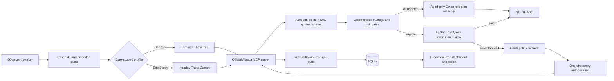

# ThetaTrap

> A bounded, MCP-native AI agent for defined-risk Alpaca paper-options trading, led by a verified-earnings thesis and an explicitly disclosed final-day competition canary.

[Live dashboard](https://104-236-77-186.sslip.io/) · [Hackathon](https://lablab.ai/ai-hackathons/alpaca-ai-trading-agents-hackathon) · [Product requirements](docs/PRD.md) · [Deployment runbook](docs/DEPLOYMENT.md) · [Submission package](docs/SUBMISSION.md)


ThetaTrap began with a simple idea from an options-trading video: earnings can make option premium expensive, and a defined-risk trade may benefit when that volatility falls after the announcement. The hard part was not describing the trade. It was building an agent that could inspect imperfect data, use a real broker interface, survive ambiguous failures, and still be unable to exceed fixed risk limits.

The result is a paper-trading agent in which Featherless-hosted Qwen investigates event risk and makes a genuine tool decision, while deterministic Python owns the candidate, strikes, price, size, maximum loss, and final permission to trade. Every Alpaca read and mutation crosses the pinned official Alpaca MCP server.

ThetaTrap is a hackathon engineering prototype. It uses Alpaca Basic indicative options data and simulated paper fills. It does **not** demonstrate proven profitability, live-capital safety, or real-time OPRA execution quality.

The earnings strategy remains the primary product. After the official September 1 and 2 runs produced no eligible four-leg candidate, the project added a **September 3-only Intraday Theta Canary** to test the same MCP/Qwen/execution architecture on liquid index ETFs. This is an adaptive competition profile, not a hidden rule change and not a generic fallback that activates whenever an earnings scan fails.

## At a glance

| Item | Current design |
| --- | --- |
| Trading environment | Alpaca paper trading only |
| Market data | Alpaca Basic indicative options data; IEX underlying quotes |
| Primary profile | Verified earnings; 7 eligible events and 2 deliberate exclusions |
| Sep 3 canary | QQQ/SPY, September 4 expiry, same-day entry and exit |
| Candidate review | Up to 2 ranked candidates per scan; eligible Sep 3 Qwen review cycles are at least 5 minutes apart |
| Broker exposure | 1 initial broker entry attempt per strategy date; at most 1 filled position |
| Structure | 1-contract, four-leg, defined-risk iron condor |
| Maximum loss | Earnings: lower of `$500` or `0.5%` of equity; canary: at most `$80` |
| AI | `Qwen/Qwen3-Coder-Next`, with `Qwen/Qwen3-32B` fallback |
| Alpaca boundary | Official `alpaca-mcp-server==2.3.0` only |
| Verification baseline | Automated unit, integration, replay, and public-boundary suite |
| Official results through Sep 2 | 314 evaluations, 0 eligible candidates, 0 orders, 0 fills, `$100,000` equity |

The competition feed combination is an explicit fail-closed profile, not an
implicit SDK default. See the [competition market-data profile](docs/COMPETITION_DATA_PROFILE.md)
for its exact environment values, audit metadata, and limitations.

**LIVE NOW:** the [public read-only competition dashboard](https://104-236-77-186.sslip.io/) reports its deployed Git SHA, current strategy profile, complete scan history, Qwen/MCP activity, orders, fills, equity, and kill-switch state. Add the demo video, final report, and LabLab project page after the competition result is frozen.

## How the strategy works

1. **Start with verified events.** The schedule is frozen from first-party investor-relations announcements instead of trusting a live calendar scraper.
2. **Measure the volatility setup.** The worker compares front- and next-week at-the-money implied volatility, calculates the expected move, and checks quote freshness, spreads, open interest, and buying power.
3. **Construct one bounded candidate.** Deterministic code searches outward from the expected-move thresholds for the nearest fully liquid short pair, then computes the exact four legs, credit, wing width, and maximum loss. Missing Basic-feed data never becomes an assumed value.
4. **Let the AI investigate.** For an eligible candidate, Qwen calls approved account, market, order, position, and news tools. It may veto a finite event risk or issue the exact pre-authorized order call. When every candidate fails deterministic gates, a separate read-only Qwen advisory explains the best rejection but cannot authorize a trade.
5. **Recheck before dispatch.** A policy gateway refreshes broker state and quotes, rejects any changed argument, consumes a date/account-bound one-shot authorization, and forwards at most one initial entry attempt for that strategy date.
6. **Manage the lifecycle.** Deterministic code reconciles ambiguous timeouts, reprices or cancels the same logical order chain, monitors positions, and submits the complete opposite-side exit at the profile's fixed time: next morning for earnings, same afternoon for the Sep 3 canary.

An iron condor sells one put spread and one call spread around the underlying. The earnings profile places the shorts beyond its expected-move threshold; the canary ranks exact `$1`-wing structures around spot by complete quote quality. The received credit is the maximum possible profit and the wings define maximum possible loss. ThetaTrap trades only one contract and never sells a naked option.

## What makes it an AI agent

Qwen is not decorative narration. It receives tool schemas, calls tools, and examines live MCP evidence. The execution reviewer can prevent an otherwise eligible candidate from trading or produce the exact `place_option_order` call. The separately persisted rejection advisor uses only six read tools and returns `REJECTION_CONTEXT_CLEAR`, `ADDITIONAL_RISK_FOUND`, or `INSUFFICIENT_ADVISORY_EVIDENCE`; none of those values can advance strategy state or authorize execution.

The model cannot choose the symbol universe, expiration, strikes, quantity, limit price, or risk. It cannot call replacement, cancellation, or exit mutations. This split gives the model a meaningful qualitative role without allowing probabilistic output to rewrite the trading policy.



## Frozen competition universe

| Date | Eligible | Excluded |
| --- | --- | --- |
| September 1, 2026 | PANW, MDB, CRDO, GTLB | DELL — `RELEASE_TIME_AMBIGUOUS` |
| September 2, 2026 | AVGO, SNOW, AI | NTAP — `REQUIRED_WEEKLY_EXPIRATIONS_UNAVAILABLE` |

For the earnings profile, up to two eligible candidates may be reviewed sequentially on a strategy date. The Sep 3 canary may reassess QQQ and SPY while its one-hour window remains open, but eligible Qwen review cycles are deterministically spaced at least five minutes apart. A veto or deterministic failure before broker dispatch may therefore be reconsidered on newer evidence. Once the single initial broker entry attempt is dispatched, ThetaTrap cannot start another candidate that date, even if the order receives no fill. Repricing remains part of that same logical order chain.

The first-party announcements and exclusion evidence are recorded in [docs/EVENT_SOURCES.md](docs/EVENT_SOURCES.md).

## Sep 3 adaptive competition profile

September 1 and 2 showed that the cloud agent and safety lifecycle worked, but the Alpaca Basic feed repeatedly failed the prerequisites for an earnings condor. The worker completed **176** scheduled candidate evaluations on September 1 and **138** on September 2. No candidate passed all deterministic gates, so Qwen received no executable candidate and the system correctly placed no order. The recurring constraints were non-consolidated underlying quotes, stale or missing open-interest dates, and invalid, stale, or wide quotes across the four required option legs.

The **Intraday Theta Canary** is the documented response for September 3 only:

| Control | Frozen value |
| --- | --- |
| Universe | QQQ and SPY, ranked by complete live quote quality; post-close diagnostics favored QQQ |
| Expiration | September 4, 2026 (one day to expiry) |
| Entry | 09:45–10:45 ET; unresolved entry canceled by 10:50 |
| Exit | Start 15:15; full-wing limit at 15:25; target broker-flat by 15:45 |
| Structure | One symmetric `$1`-wide iron condor, one contract |
| Credit and loss | Minimum `$0.20` credit; maximum defined loss `$80` |
| Quote evidence | Underlying age `<=10s` and spread `<=0.20%`; option age `<=60s`; shorts `<=min($1, 25%)`, wings `<=min($1, 50%)` |
| Open interest | Numeric; shorts `>=500`, wings `>=100`; date no more than three prior trading sessions old |
| Qwen cadence | Review both ranked candidates at most once per 5-minute cycle; hard 90-second/10-turn/12-tool-call limit per candidate |

The profile changes the source of the opportunity, not the responsibility boundary. Deterministic code still ranks the universe, chooses every leg and number, and performs the same fresh policy recheck. Qwen still must call bounded Alpaca MCP reads and either veto or issue the exact immutable entry call. Entry remains one-shot and the exit remains deterministic.

This profile is **not** an always-on backup strategy and is not automatically selected after a rejected earnings scan. It is date-scoped, separately authorized, visibly labeled in the dashboard, and should be evaluated as an execution experiment rather than evidence of a validated edge. A profit, loss, unfilled order, or veto will all be reported as observed.

## Safety and reliability boundaries

- Paper trading is a configuration invariant; live-capital execution cannot be enabled.
- Exactly one contract and one open strategy position are allowed.
- The four-leg order must match an immutable, hashable intent exactly.
- Static environment flags are insufficient: one date-, account-, and environment-bound authorization must be consumed atomically before dispatch.
- Working orders use deterministic client IDs, preventing a timeout from creating an uncontrolled duplicate.
- A filled exit is not treated as flat until a later broker snapshot confirms zero positions and zero open orders.
- Assignment, exercise, corporate-action, non-option exposure, or broken-leg evidence enters audited `RISK_OFF` and requires manual broker resolution.
- The kill switch blocks new exposure but never blocks a position-reducing exit.
- The long-running worker owns reconciliation and exit; armed execution rejects `worker --once`.

## Implemented system

- Official Alpaca MCP v2.3.0 over stdio, with a pinned 19-tool required-schema hash and no direct Alpaca SDK or REST path.
- Native four-leg MLEG entry and exit, one logical replacement/cancel chain, cancel/fill race handling, and client-ID recovery after ambiguous mutation timeouts.
- SQLite audit records for tool calls, execution decisions, separately labeled non-authorizing advisories, market evidence, policy gates, authorizations, orders, fills, positions, equity, and state transitions.
- A single-flight worker lease and restart reconciliation.
- A private Streamlit operator dashboard, an isolated public read-only judge dashboard with every symbol/scan/gate and Qwen/MCP timeline, and deterministic JSON/Markdown reports.
- A simulation-only replay covering an eligible candidate, stale-data rejection, model veto, duplicate-timeout recovery, and complete exit.
- Docker Compose deployment with a single worker and loopback-only operator UI.

## Evidence and current status

The deployed baseline passed the automated suite and a credentialed competition-account smoke run inside the DigitalOcean image completed all five official MCP reads through Qwen with zero mutation tools exposed. Preflight confirmed an active, flat `$100,000` paper account with options level 3.

- **September 1:** 176 deterministic evaluations across PANW, MDB, CRDO, and GTLB; zero eligible candidates, order attempts, or fills.
- **September 2:** 138 deterministic evaluations across AVGO, SNOW, and AI; zero eligible candidates, order attempts, or fills. The separately labeled Qwen advisory completed six official read-only MCP calls and confirmed that no qualitative context could override the deterministic rejection.
- **Observed account result through September 2:** flat, zero open orders, and `$100,000` equity.
- **September 3:** the Intraday Theta Canary is the date-scoped final competition profile. Its actual decision, order, fill, exit, and P&L must come from the public dashboard and final report; this README does not pre-claim an outcome.

Cloud restart recovery preserved the same database and zero duplicate order attempts. The testing account remains stopped/disarmed and is used only for local fixtures and replay.

Do not read a zero-trade replay or an unchanged account as profitability evidence. Final claims must come from the submitted competition account's timestamped equity and order history. See the sanitized [replay summary](evidence/replay-summary.md) and [release validation summary](evidence/validation-summary.md). Credentials, SQLite databases, and raw worker logs do not belong in public evidence.

Pivot-aware collateral sources: [one-page write-up](docs/ONE_PAGER.md) · [six-slide deck](docs/PITCH_DECK.md) · [demo script](docs/DEMO_VIDEO.md). The binary PDFs/PPTX under `docs/submission/` are pre-result drafts and must be regenerated after the September 3 broker outcome is frozen.

## Quick start

Python 3.12 and [`uv`](https://docs.astral.sh/uv/) are required.

```bash
uv sync --frozen --no-editable
PYTHONPATH=src .venv/bin/pytest -q
cp .env.dev.example .env.dev
chmod 600 .env.dev
```

Keep `.env.dev` disarmed. Placeholder credentials are sufficient for the broker-isolated baseline because it makes no network calls. Run:

```bash
PYTHONPATH=src .venv/bin/python -m thetatrap.cli --env-file .env.dev check-config
PYTHONPATH=src .venv/bin/python -m thetatrap.cli --env-file .env.dev init-db
PYTHONPATH=src .venv/bin/python -m thetatrap.cli \
  --env-file .env.dev replay --output-db artifacts/replay.sqlite3
```

View the fixture database locally without starting a broker-connected worker:

```bash
THETATRAP_DATABASE_PATH=data/dev/thetatrap.sqlite3 \
THETATRAP_ENVIRONMENT=development \
THETATRAP_READ_ONLY=true \
THETATRAP_EXECUTION_ENABLED=false \
PYTHONPATH=src .venv/bin/streamlit run src/thetatrap/dashboard.py
```

The operator dashboard binds to `127.0.0.1:8501`. It must remain private because it includes the kill switch. Never publish that service directly.

## Testing and competition accounts

The two accounts have deliberately different roles:

- **Testing account:** local fixture and replay only. Keep it stopped/disarmed in `.env.dev` with its own SQLite path; do not start a broker-connected worker for it.
- **Competition account:** the fresh `$100,000` account used from the beginning for the controlled live canary, cloud worker, and official submission. Keep it in `.env.competition` with a different UUID, key pair, and database volume. Arm its first order only after every read-only gate passes.

Never run two workers against one account. During the official window, the testing worker stays stopped or disarmed. Both roles run the same reviewed Git revision, but their credentials and state are never copied between environments.

The exact one-shot arming procedure, restart proof, emergency operations, and final report export are in [docs/DEPLOYMENT.md](docs/DEPLOYMENT.md).

### Competition account discovery and AI smoke

Copy `.env.competition.example` to the ignored `.env.competition`, add the competition Alpaca key pair and Featherless key, and leave execution disarmed. Discover the UUID on the trusted local machine:

```bash
PYTHONPATH=src .venv/bin/python -m thetatrap.cli \
  --env-file .env.competition discover-account
```

This command calls only MCP `get_account_info`, prints the UUID locally, and does not bind it to the database. Put the returned UUID—not the `PA...` account number—into `THETATRAP_EXPECTED_ACCOUNT_ID`, then run:

```bash
PYTHONPATH=src .venv/bin/python -m thetatrap.cli \
  --env-file .env.competition agent-smoke
PYTHONPATH=src .venv/bin/python -m thetatrap.cli \
  --env-file .env.competition preflight
```

`agent-smoke` makes a real bounded Qwen request, exposes exactly five read-only official MCP tools, and requires a structured `READY` or `NOT_READY` result with finite reason codes. A `PASS` proves the MCP/model loop completed; the separate readiness field reports whether the observed account state is safe for the next preflight. It persists only redacted/hash evidence. Neither setup command has an entry-order tool path. Keep their raw local output out of the public repository.

After a completed zero-eligible strategy run, an operator may request exactly one
separately persisted, non-authorizing Qwen explanation of its best deterministic
rejection:

```bash
PYTHONPATH=src .venv/bin/python -m thetatrap.cli \
  --env-file .env.competition advisory-review --strategy-date 2026-09-01
```

The command exposes exactly six bounded read-only MCP tools, refuses any run
with an eligible candidate or order state, fingerprints strategy/order state
before and after the review, and is idempotent for that strategy run.

## Repository map

```text
src/thetatrap/       agent, strategy, policy, MCP, execution, state, and UI
config/              pinned MCP contract and frozen event schedule
tests/               deterministic unit, integration, replay, and safety tests
docs/                PRD, deployment, submission, demo, deck, and disclosures
docs/assets/         publishable image and video asset manifest
evidence/            sanitized, judge-readable run evidence only
```

## Limitations

- Basic indicative options data is not consolidated OPRA data.
- Alpaca paper fills omit important live-market effects and cannot prove executable profitability.
- The event universe and expirations are intentionally frozen for one competition week.
- The Sep 3 canary was selected after observing two no-trade days and has not been backtested as a standalone strategy.
- A same-day paper round trip can create nonzero P&L, but its sign is uncertain and neither outcome validates expected value.
- One official competition result cannot establish long-run expected value.
- Abnormal broken-position liquidation remains a manual broker operation.
- The system has not been approved for live capital.

## Future improvements

- Calibrate the premium signal against causally valid historical implied and realized volatility.
- Add OPRA-quality quotes and explicit transaction-cost/slippage modeling.
- Expand the event universe only after automated first-party event verification is reliable.
- Evaluate model decisions and veto quality across more events and open-source models.
- Add exportable judge filters and alert delivery to the implemented historical dashboard.
- Extend monitoring, alerting, and recovery testing beyond the competition window.

## Submission material

- [Exact portal copy](docs/SUBMISSION_COPY.md)
- [LinkedIn draft](docs/LINKEDIN_POST.md)
- [Demo video script and shot list](docs/DEMO_VIDEO.md)
- [Six-slide deck outline](docs/PITCH_DECK.md)
- [One-page project write-up](docs/ONE_PAGER.md)
- [Disclosures and claims](docs/DISCLOSURES.md)
- [Final checklist](docs/SUBMISSION.md)

## License and disclaimer

Released under the [MIT License](LICENSE).

This repository is for education, engineering evaluation, and paper trading. It is not financial advice, an offer to trade, or evidence that the strategy will be profitable.
